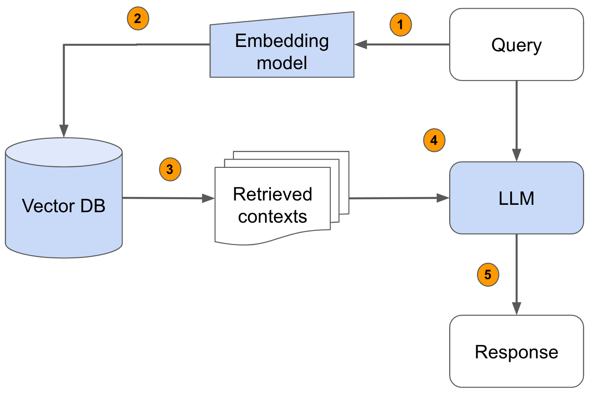

# rag
A comprehensive guide to building RAG-based LLM applications



Source: RAG

## Installation

1. Clone the repository to your local machine:

```bash
git clone https://github.com/sumedhrasal/rag.git
cd rag
```

2. Set up your environment variables using a `.env` file:

```
OPENAI_API_KEY=your-openai-api-key
```

3. Build the docker image.

```bash
docker build -t rag_api .
```

4. Run the docker image.

```bash
docker run --rm -p 8080:8080 rag_api
```

5. Invoke application

```bash
curl --location 'http://0.0.0.0:8080/company/batch' \
--header 'Content-Type: application/json' \
--data '{
    "company": "Glydways"
    }'
```

```bash
{
    "response": {
        "Company": "Glydways is a company that develops on-demand Personal Rapid Transit (PRT) systems. The company was founded in 2016 and is headquartered in South San Francisco, CA. Glydways' PRT system consists of on-demand, personal, autonomous, electric vehicles that travel on small, dedicated rights of way.2. Glydways is currently expanding its operations and business reach. The company has been selected by Contra Costa Transportation Authority and Tri Delta Transit for the initial vital segment of the Dynamic Personal Micro Transit project to increase public transit accessibility for the fast-growing communities of Pittsburg, Antioch, Oakley and Brentwood.",
        "Competitors": "Competitors or alternatives to Glydways include traditional mass transit systems such as rail or bus lanes.",
        "Finanicals": "Glydways is generating revenue and has raised a total of $70 million in funding.",
        "Industry": "The industry category that best suits Glydways is the transportation industry.",
        "Leadership": "The individuals in Glydways' leadership team include Gokul Hemmady (CEO), Mark Seeger (Founder), and Blake Barber (CTO).",
        "PEST Analysis": {
            "Economic": "\n\nThe Robo-Taxi Market is expected to grow at a CAGR of 54.3% from 2023 to 2029.\n\nThe market is driven by the increased investment in autonomous driving technology, the growing popularity of ride-sharing services, and the advances in battery technology.",
            "Political": "\n\nThe Robo-Taxi Market is a rapidly growing industry driven by various factors such as technological advancements, changing consumer behaviour, government policies and regulations, environmental concerns, cost-effectiveness, and safety and security. As a research company, our report provides a comprehensive analysis of the Robo-Taxi Market, including its drivers, challenges, opportunities, and regional outlook. The report highlights the impact of technological advancements and changing consumer behaviour on the Robo-Taxi Market, along with government policies and regulations that are shaping the industry's future. It also covers the competitive landscape and infrastructure requirements, which are essential for the widespread adoption of autonomous vehicles. Additionally, the report delves into the challenges facing the industry, including safety and security concerns. Our research offers valuable insights into the Robo-Taxi Market, enabling companies to make informed decisions and gain a competitive edge in this dynamic and rapidly evolving industry.",
            "Social": "\n\nThe Robo-Taxi Market is expected to grow at a CAGR of 54.3% from 2023 to 2029.\n\nThe market is driven by the increased investment in autonomous driving technology, the growing popularity of ride-sharing services, and the advances in battery technology.\n\nThe major players in the market are Waymo LLC, Cruise Automation, Voyage, Aptiv PLC, and nuTonomy.\n\nSOURCES:\n\n/Users/srasal/Sumedh/github/rag/rag/raw_data/glydways/maximizemarketresearch.txt",
            "Technological": "\n\nThe Robo-Taxi Market is expected to grow at a CAGR of 54.3% from 2023 to 2029.\n\nThe market is driven by the increasing investment in autonomous driving technology, the growing popularity of ride-sharing services, and the advances in battery technology."
        },
        "Value Proposition": "Glydways' value proposition is its low upfront costs, small physical and environmental footprint"
    }
}
```